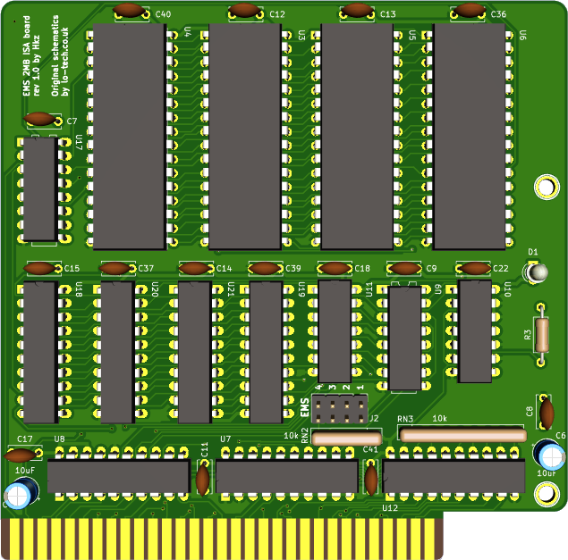

# ISA 4Mb EMS / ROM Adapter

## Introduction

This is a reimplementation of the **lo-tech.co.uk** [2Mb ISA EMS board](https://www.lo-tech.co.uk/wiki/Lo-tech_2MB_EMS_Board) with small changes:

- All components are thru-hole instead of SMD
- Maximum installable memory expanded to 4Mb
- Activity led to indicate when the memory is accessed
- Optional ROM expansion (had some free space on the PCB...)



### Disclaimer

I take NO responsibility for what happens if you decide to build and use this card. Your computer might crash, catch fire or be destroyed in other nasty ways.
Also, as this card is mostly based on the work of others, You're encourauged to take what you deem fit from this, and use it in your projects!

Additionally, do **NOT CONTACT lo-tech.co.uk FOR SUPPORT**, while this board is derived from their work, it is not their product, please do not waste their time.

## Configuration

### EMS

To configure the EMS, jumpers on J2 header are used.

Pins 1 and 2 configure the Page Frame base address, while 3 and 4 configure the IO Port base address.

```text

EMS Page Frame Base
 1 | 2 | Base  |
---+---+-------+
 X | X | C000h |
---+---+-------+
   | X | D000h |
---+---+-------+
 X |   | E000h |
---+---+-------+
   |   | Inval |
---+---+-------+

EMS IO Port Base
 3 | 4 |   Base     |
---+---+------------+
 X | X |  260-263h  |
---+---+------------+
   | X |  264-267h  |
---+---+------------+
 X |   |  268-26Bh  |
---+---+------------+
   |   |  26C-26Fh  |
---+---+------------+

```

### ROM

To configure the expansion ROM, jumpers on J3 header are used.

The `ENA` pin will enable the ROM when jumpered.

When `32K` pin is jumpered, only 32Kb of the ROM will be used. The ROM can be made to appear at the following addresses:

```text
       | A18 | A17 | A16 | A15 |
-------+-----+-----+-----+-----+
 A000h |  X  |     |  X  |  X  |
-------+-----+-----+-----+-----+
 A800h |  X  |     |  X  |     | (32K only)
-------+-----+-----+-----+-----+
 B000h |  X  |     |     |  X  |
-------+-----+-----+-----+-----+
 B800h |  X  |     |     |     | (32K only)
-------+-----+-----+-----+-----+
 C000h |     |  X  |  X  |  X  |
-------+-----+-----+-----+-----+
 C800h |     |  X  |  X  |     | (32K only)
-------+-----+-----+-----+-----+
 D000h |     |  X  |     |  X  |
-------+-----+-----+-----+-----+
 D800h |     |  X  |     |     | (32K only)
-------+-----+-----+-----+-----+
 E000h |     |     |  X  |  X  |
-------+-----+-----+-----+-----+
 E800h |     |     |  X  |     | (32K only)
-------+-----+-----+-----+-----+
 F000h |     |     |     |  X  |
-------+-----+-----+-----+-----+
 F800h |     |     |     |     | (32K only)
-------+-----+-----+-----+-----+
```


## Usage

You need a **memory manager** to use this board. The original `LTEMM` driver provided by lo-tech only supports up to 2Mb. You can find a modified version under the `software` directory of this repository that supports up to 4Mb (actually 4080Kb or 255 pages, to support all 256 pages I need to rework the detection logic a bit... will get around to it in the future).

## Bill of Materials

All ICs are in DIP package.

If you don't need the expansion ROM feature, you can omit C19, C20, U1, U2, RN1, R1, R2 and J3.

- U1, U7, U8: 74HCT688
- U2: SST39SF010
- U3, U4, U5, U6, U13, U14. U15, U16: AS6C4008 (You don't need to fill all sockets: fit as much memory as you need starting from socket 1!)
- U11: 74HC04 (HCT is fine too)
- U9: 74HCT139
- U10: 74HCT32
- U12: 74ACT245
- U17: 74HCT139
- U18, U19, U20, U21: 74HCT573
- RN1: res. network, 10k, bussed, 6 pins
- RN2: res. network, 10k, bussed, 5 pins
- RN3: res. network, 10k, bussed, 9 pins.
- R1, R2: 10k resistor
- R3: ~470-1k resistor (depends on the type of LED mounted on D1 and desired brightness)
- D1: 3.0mm or 5.0mm LED
- J2 2x4 2.5mm breakable header
- J3 2x7 2.5mm breakable header
- C5, C6: 10uF / 50v electrolytic caps
- Remaining caps: 22x 100nF, ceramic
- ISA bracket: Keystone 9202, plus screws

## Credits

- Thanks to [lo-tech.co.uk](https://www.lo-tech.co.uk/) for having published their schematics
- Thanks to [Sergey](http://www.malinov.com/Home/sergeys-projects) for all his projects!

